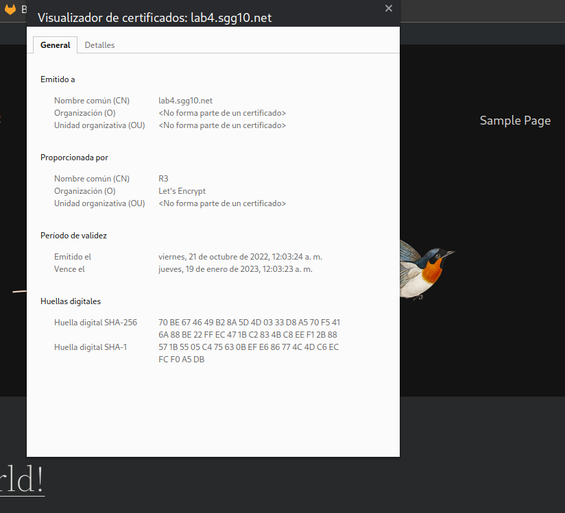

# Laboratorio 4 - WordPress
__Profesor:__

 Edwin Nelson Montoya Munera | emontoya@eafit.edu.co

## 1. Descripción de actividad

-  Se implementa un servidor DNS con la herramienta Google Cloud que cumple con las siguientes funciones:

    -  Almacenar los diferentes registros del servidor web, para de esta manera permitir el acceso al mismo

    -  Almacenar  el token de la herramienta Let's Encrypt para permitir la comunicacion de manera segura entre cliente y servidor por medio de mensajes cifrados

- Se implementa el depliege de una aplicacion monolitica con balanceo y datos distribuidos que cumple con los siguientes requisitos:

    - Despliegue de balanceador de cargas basado en nginx, utilizando la herramienta de docker para su despliege. Dicho balanceador de carga, redirecciona el trafico web https a multiples instancias

    - Despliege de dos instancias de procesamiento en las virtual machine de GCP, utilizando docker para su despliege

    - Una base de datos distribuida, concretamente una instancia de mysql sobre docker para la persistencia de los datos

    - Despliege de una instancia de NFS, para tener archivos distribuidos dentro de nuestra aplicacion, con el fin de ser compartidos por las instancias de wordpress

    - Permitir la comunicación de manera segura entre el cliente y el servidor. Esto gracias al uso de un certificado ssl con Let's Encrypt

    - El certificado esta habilitado para el subdominio lab4.sgg10.net

## 2. Descripción del ambiente, lenguajes, librerías, paquetes, etc.

__Versiones de servicios utilizados:__
- **Nginx:** nginx/1.18.0 (Ubuntu)
- **docker:** 20.10.12-0ubuntu2~20.04.1
- **letsencrypt:** certbot 0.40.0
- **docer-compose:**  version 1.25.0
- **wordpress:** version 6.0.2

## 3. Accesos

- Resultado final: https://lab4.sgg10.net/
- IP Wordpress 1: 35.225.6.253
- IP Wordpress 2: 35.202.103.32
- IP NFS: 35.222.119.183
- IP MYSQL: 35.238.74.10

## 4. Servicios (Docker)
Podra encontrar en este repositorio los directorios para
- MySQL
- Wordpress
- Nginx

donde vera cada uno de los archivos `docker-compose.yml` que se utilizaron

## 5. Desarrollo y configuración

### NFS (Server) install

### NFS Exports

### NFS Firewall

### Final result:

### SSL
