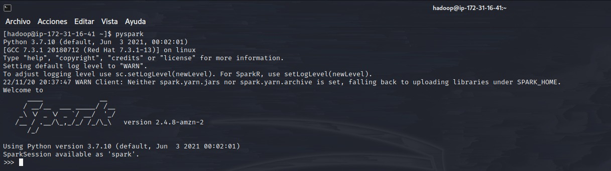
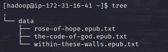
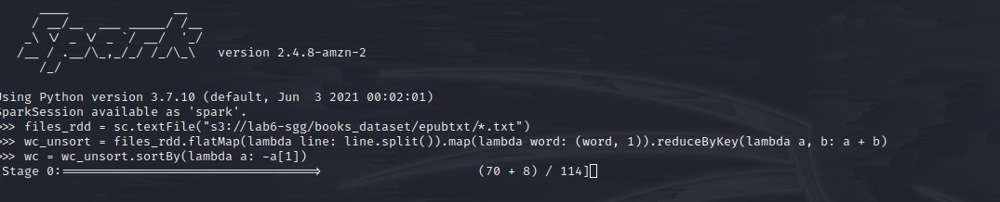
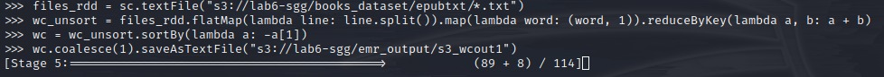
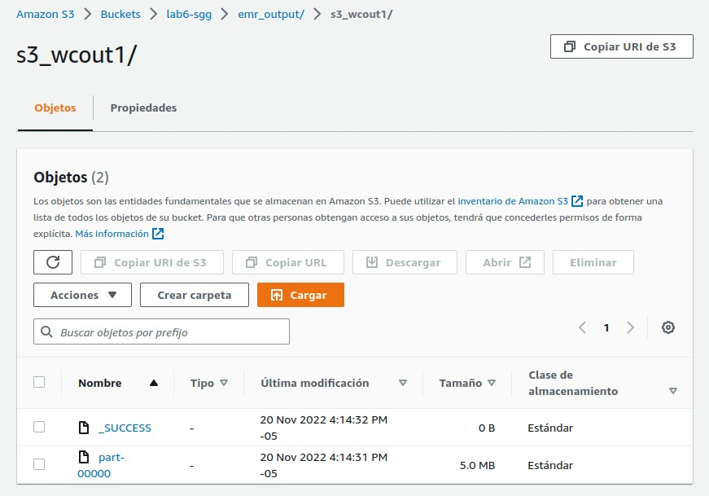
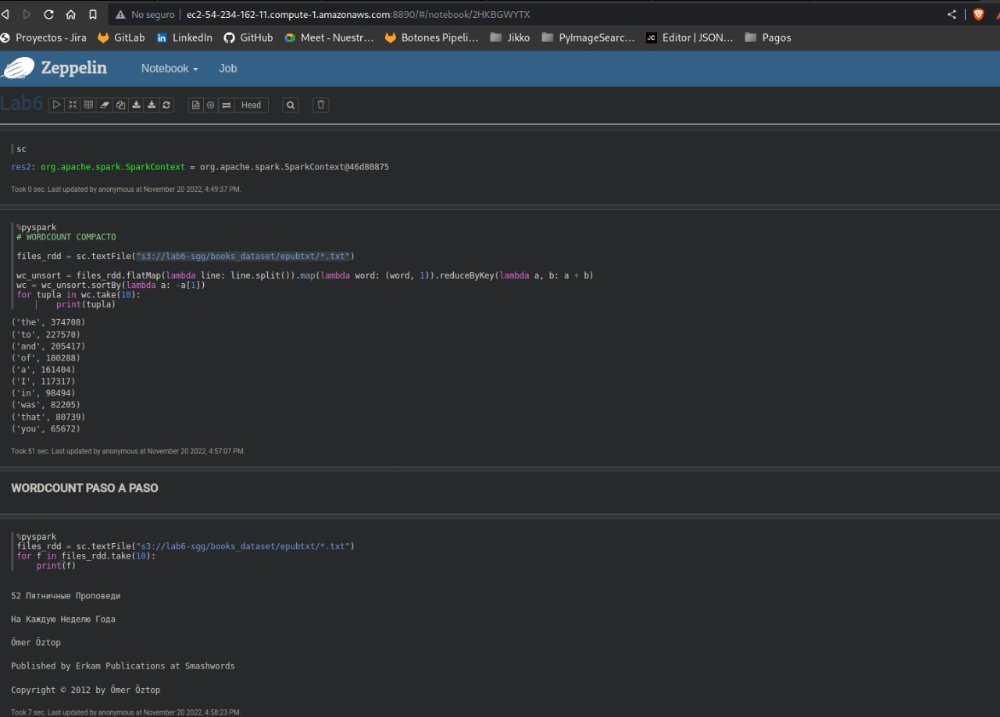

# Laboratorio 6 - Spark
__Profesor:__

Edwin Nelson Montoya Munera | emontoya@eafit.edu.co

## Acceso
+ En este repositorio encontrara una llave .pem con la que podras acceder al cluster de EMR
+ Puede ingresar usando el comando: `ssh -i lab6.pem hadoop@ec2-54-234-162-11.compute-1.amazonaws.com`

## Desarrollo de la actividad

+ Para la primera parte, se usan archivos .txt de [este](https://www.kaggle.com/datasets/paulrohan2020/huge-books-in-plain-text-for-train-language-models) dataset, para poder disponer de muchos mas datos

+ Para la segunda sección del laboratorio, se usa la plataforma [DeepNote](https://deepnote.com/) donde se utiliza una integración con AWS S3 para facilitar el acceso a los datos.

### Evidencias de desarrollo

+ Acceso a PySpark interactivo

+ Data dentro de cluster

+ Contador de palabras

+ Output en AWS S3

+ Ejecución de contador de palabras en Notebook (Zeppelin), podra encontrar una copia del notebook en la carpeta `notebooks` de este repositorio

+ Procesamiento de datos: para esta sección, se añade una copia de notebook en la carpeta `notebooks`, ademas que podra acceder y ejecutar el notebook [aquí](https://deepnote.com/workspace/sgg10-a5767594-bfab-4eb2-853a-22ed4ba8b5f7/project/Lab6-c89dda14-24d9-45e9-90f2-749010ec01a5/%2FData_processing.ipynb) (Deepnote)

